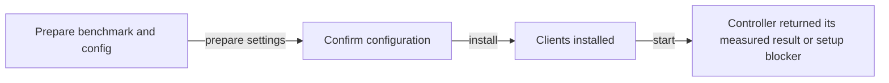
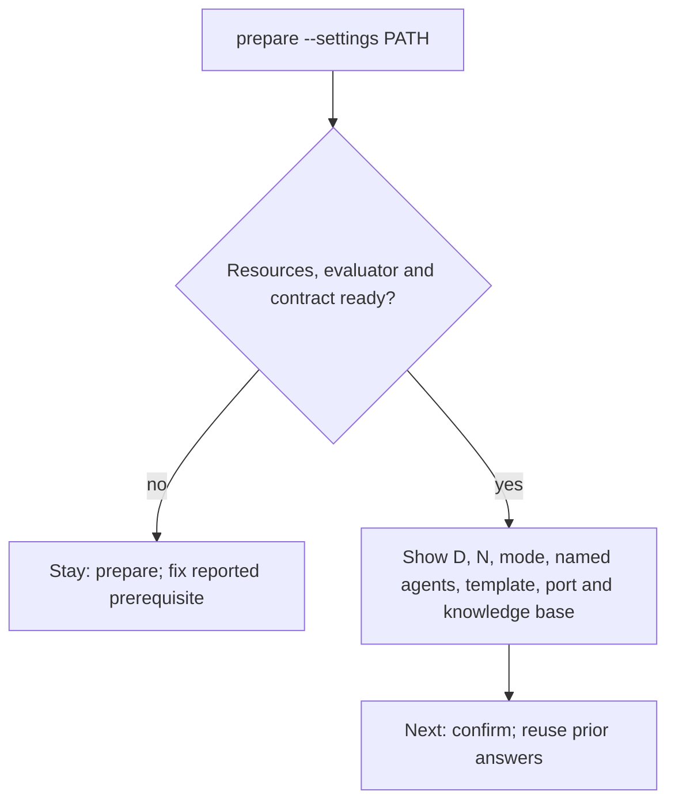
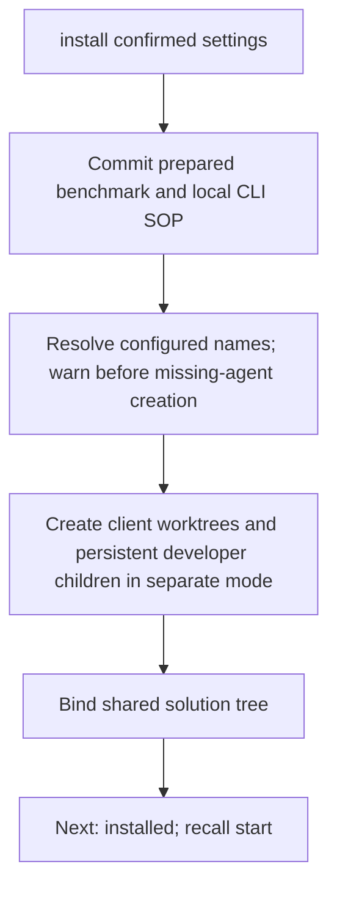

# Installation protocol

```mermaid
flowchart LR
    prepare[Prepare benchmark and config] -->|prepare settings| confirm[Confirm configuration]
    confirm -->|install| installed[Clients installed]
    installed -->|start| running[Controller returned its measured result or setup blocker]
```

State: `prepare`

```mermaid
flowchart TD
    prepare["prepare --settings PATH"] --> checks{Resources, evaluator and contract ready?}
    checks -->|no| stay["Stay: prepare; fix reported prerequisite"]
    checks -->|yes| settings[Show D, N, mode, named agents, template, port and knowledge base]
    settings --> confirm["Next: confirm; reuse prior answers"]
```

State: `confirm`

```mermaid
flowchart TD
    install[install confirmed settings] --> template[Commit prepared benchmark and local CLI SOP]
    template --> agent[Resolve configured names; warn before missing-agent creation]
    agent --> clients[Create client worktrees and persistent developer children in separate mode]
    clients --> tree[Bind shared solution tree]
    tree --> installed["Next: installed; recall start"]
```
